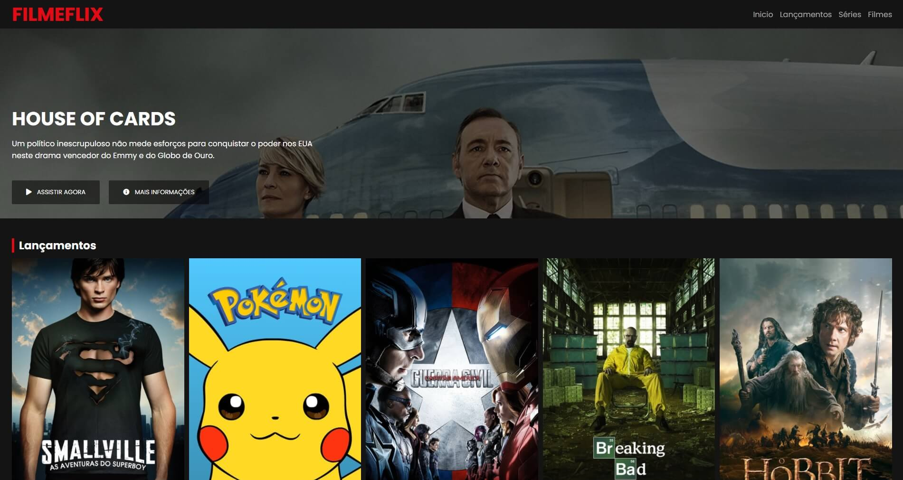
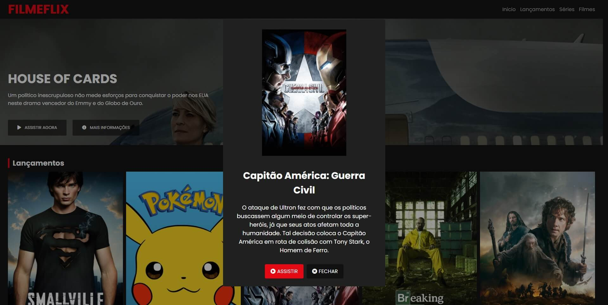

<h1 align="center">
  FILMEFLIX
</h1>

<h4 align="center">Status: ✔ Concluído</h4>

<div align="center">
  
</div>
<div align="center">
  
</div>

---

<p align="center">
 <a href="#user-content-sobre-o-projeto">Sobre o projeto</a> |
 <a href="#user-content-adicionais">Adicionais</a> |
 <a href="#user-content-executando-o-projeto">Executando o projeto</a> |
 <a href="#user-content-tecnologias">Tecnologias</a>

---

## **Sobre o projeto**

Clone da tela principal do Netflix construído no bootcamp [HTML Web Developer](https://digitalinnovation.one/bootcamps/html-web-developer) com a [Digital Innovation One](https://digitalinnovation.one/) e o [Felipe Aguiar](https://www.linkedin.com/in/felipe-aguiar-047/). [Link para o repositório original.](https://github.com/felipeAguiarCode/netflix-clone)

## **Adicionais**
Nesta versão foi acrescentado:

- Ao clicar no item de menu de navegação, é feito um scroll suave até a seção correspondente
- Ao clicar em um poster, será aberta uma janela popup com o título e a sinopse
- Servidor de desenvolvimento

## **Executando o projeto**

### Pré-requisitos
Antes de começar, é necessário você já tenha as ferramentas [Node.js](https://nodejs.org/en/) e [Git](https://git-scm.com/) instaladas.

### Instruções de execução do projeto
```bash
# Clone este repositório
$ git clone https://github.com/ViniciusHP/netflix-clone.git

# Acesse a pasta deste projeto por meio do terminal
$ cd netflix-clone

# Instale as dependências deste projeto
$ npm install

# Execute o projeto em modo de desenvolvimento
$ npm run dev

# O servidor de desenvolvimento será iniciado na porta 3000
# Para acessar o projeto, navegue para http://localhost:3000
```

## **Tecnologias**

Este projeto foi construído com as seguintes ferramentas:

- **[JavaScript](https://developer.mozilla.org/pt-BR/docs/Web/JavaScript)**
- **[HTML](https://developer.mozilla.org/pt-BR/docs/Web/HTML)**
- **[CSS](https://developer.mozilla.org/pt-BR/docs/Web/CSS)**
- **[SweetAlert2](https://sweetalert2.github.io/)**
- **[OwlCarousel2](https://owlcarousel2.github.io/OwlCarousel2/)**
- **[Lite-server](https://github.com/johnpapa/lite-server)**
